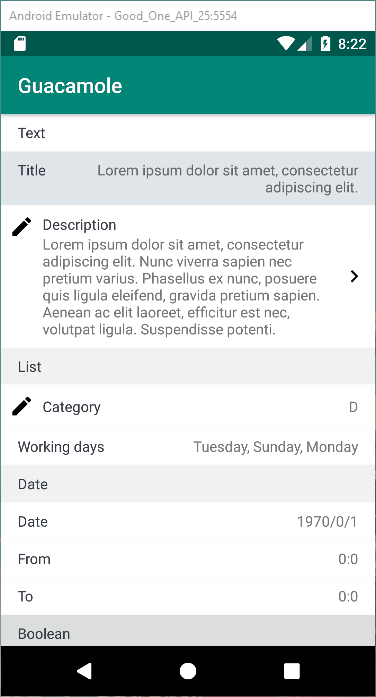

# Guacamole

[](https://jitpack.io/#Alenkart/guacamole)

Guacamole is library to build forms dynamically in android.

## Components Demo



Each of the components has the following propeties: icon, title and subTitle.

## Title
```kotlin
val titleText = TitlePreference("title")
titleText.title = "Text"
```

## Text
Creates a single line text editor in alert.
```kotlin
val titlePref = TextPreference("titlePref")
titlePref.title = "Title"
titlePref.subTitle = "Lorem Ipsum"
```

## Description
Creates a multi line text editor.
```kotlin
val descriptionPref = DescriptionPreference("descriptionPref")
descriptionPref.title = "Description"
descriptionPref.subTitle = "Lorem Ipsum"
```

## Description
Creates a multi line text editor.
```kotlin
val descriptionPref = DescriptionPreference("descriptionPref")
descriptionPref.title = "Description"
descriptionPref.subTitle = "Lorem Ipsum"
```

## Single choise list
```kotlin
val categoryPref = SingleListPreference("categoryPref")
categoryPref.itemList = arrayOf("A", "B", "C", "D", "E", "F", "G")
categoryPref.title = "Category"
categoryPref.alertButton = "Save"
categoryPref.selectedItem = 3
```

## Multi choise list
```kotlin
val weeksPref = MultiListPreference("categoryPref")
weeksPref.title = "Working days"
weeksPref.alertButton = "Save"
weeksPref.itemList = hashMapOf(
    "Monday" to true,
    "Tuesday" to true,
    "Wednesday" to false,
    "Thursday" to false,
    "Friday" to false,
    "Saturday" to true,
    "Saturday" to false,
    "Sunday" to true
)
```

## Date Picker

```kotlin
val datePickerPref = DatePickerPreference("datePickerPref")
datePickerPref.title = "Date"
datePickerPref.year = 1995
datePickerPref.month = 1
datePickerPref.month = 25
```

## Time Picker
```kotlin
val fromTimePickerPref = TimePickerPreference("timePickerPref")
fromTimePickerPref.title = "From"
fromTimePickerPref.hours = 22
fromTimePickerPref.minutes = 22
```

## Switch
```kotlin
val statusPref =  SwitchPreference("statusPref")
statusPref.title = "Status"
statusPref.subTitle = "Lorem Ipsum"
statusPref.statusOff = "Inactive"
statusPref.statusOn = "Active"
```

## CheckBox
```kotlin
val checkPref =  CheckBoxPreference("statusPref")
checkPref.title = "Status"
checkPref.subTitle = "Lorem Ipsum"
```